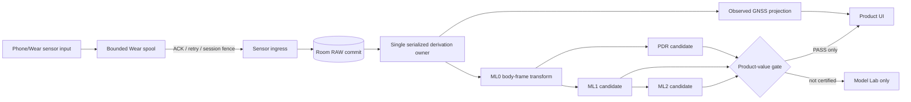

# KullChip Engineering Case Study

[](https://github.com/cheolgyu/kullchip-engineering-case-study/actions/workflows/safety.yml)

> Phone/Wear 센서 기반 반려견 산책·행동 추론을 실제 산책에서 검증하고, 제품 기준을 통과하지 못한 자동 추론을 차단한 엔지니어링 사례입니다.

이 저장소는 출시된 제품의 전체 소스가 아닙니다. 비공개 원본 저장소의 `kullchip-8.1.0-sealed` 기준에서 개인정보, 위치 원본, 인증정보, 내부 프롬프트와 생성 산출물을 제외하고 **설계 판단·대표 구현·검증 결과만 선별한 공개 포트폴리오**입니다.

[English summary](README.en.md) · [선별 소스 설명](docs/07-selected-source-notes.md) · [주장 범위](docs/06-claims-boundary.md)

## 한눈에 보기

| 항목 | 내용 |
|---|---|
| 기간 | ColaZZang 선행 프로토타입 2025.02–2026.01 → KullChip 2026.03–2026.08 |
| 역할 | 제품 방향, 아키텍처, 현장 데이터 수집, 합격 기준, 검증 및 중단 판단 직접 소유 |
| Android/Wear | Kotlin, Compose, Room, Coroutines, Wear Data Layer, GNSS, 6축 IMU |
| Backend | Rust, tonic gRPC-Web, ConnectRPC TypeScript client, Axum, SQLx, PostgreSQL, batch/outbox |
| Validation | Python 평가 도구, walk 단위 holdout, 단순 기준선 비교, 제품 승격 gate |
| 최종 상태 | 8.1.0에서 봉인. 관측 산책 기록은 보존하고 미검증 PDR/ML 제품 노출은 차단 |

## 해결하려던 문제

```text
Phone/Pet Watch GNSS + 50Hz IMU
  → 끊김에도 유실되지 않는 RAW 수집
  → 결정론적 몸축 변환과 PDR 후보
  → ML1 몸짓 분류
  → ML2 의미 사건 후보
  → 사용자 확인
  → 경로·기억·다음 산책 개선
```

기술 파이프라인이 실행된다는 사실과 사용자에게 가치가 있다는 사실을 분리하는 것이 핵심 과제였습니다.

## 구현한 핵심 구조



- Phone/Wear 입력을 하나의 ingress로 수렴시키고 RAW를 durable commit한 뒤 파생 처리를 시작했습니다.
- Wear 연결 단절을 bounded segmented spool, ACK, 재전송, operation/session fence로 처리했습니다.
- 활성 산책 상태 변경은 단일 runtime owner가 직렬화했습니다.
- UI는 RAW를 직접 스캔하지 않고 Room projection만 소비하도록 분리했습니다.
- 제품 앱과 검증 앱·Model Lab의 실행 권한을 분리했습니다.
- 모델 버전이나 처리 성공만으로 제품 READY가 되지 않도록 artifact SHA, walk 단위 split, 기준선 우위와 품질 gate를 함께 요구했습니다.

자세한 내용은 [시스템 아키텍처](docs/02-architecture.md)를 참고하십시오.

## 측정 결과와 최종 판단

가장 큰 검증 가능 데이터 스냅샷은 10개 산책, IMU 1,642,362행, 펫 GNSS 31,081행, 사용자 축 라벨 749행과 episode 16행이었습니다. 원본 데이터는 개인정보 보호를 위해 공개하지 않습니다.

| 단계 | 측정 | 판단 |
|---|---|---|
| PDR, 5초 GNSS 공백 | median 1.34m / P95 5.91m | 단순 기준선보다 나았으나 단일 펫·과거 데이터이므로 후보 유지 |
| PDR, 10초 GNSS 공백 | median 2.33m / P95 10.99m | 추가 다중 펫·실기기 검증 전 제품 권한 없음 |
| ML1 movement | 재학습 artifact의 untouched walk macro-F1 0.14 | 제품 가치 주장 불가 |
| ML1 oral | 재학습 artifact의 untouched walk macro-F1 0.07 | 제품 가치 주장 불가 |
| ML1 시간 안정성 | 같은 정답 구간에서도 시간당 수백 회 상태 전환 | 제품 노출 차단 |
| ML2 | 확정 사건과 독립 train/holdout 부족 | 탐지율·오경보 측정 불가, 가치 주장 차단 |

결론은 “모델 파이프라인 완성”이 아니라 다음과 같습니다.

> 관측할 수 없는 것을 추론하려 했고, 데이터와 시간 안정성이 제품 기준을 충족하지 못했다. 관측 GPS와 사용자 확인 기록만 제품 사실로 남기고 자동 PDR/ML 출력은 fail-closed한 뒤 개발을 중단했다.

[전체 검증 해설](docs/03-validation.md) · [기계 판독용 집계](evidence/validation/metrics.json)

## ColaZZang에서 KullChip으로

ColaZZang은 KullChip과 동일한 Git 코드베이스가 아니라 선행 프로토타입입니다.

- ColaZZang: 약 1년간 단일 작성자 이력으로 Phone/Wear 산책 기록, GPS·센서, Room, 지도와 Wear 동기화 구현
- KullChip: 현장에서 드러난 발열·연결 단절·데이터 소유권 문제를 바탕으로 별도 clean-room 아키텍처 구축
- KullChip에서는 AI coding agent를 구현·리뷰 가속 도구로 사용했으며, 제품 방향·실기기 검증·합격 기준·중단 판단은 직접 소유

[기술 계보](docs/01-lineage.md) · [AI 사용과 책임 경계](docs/05-ai-assisted-development.md)

## 공개한 코드 증거

`evidence/selected-source`에는 원본 8.1.0에서 선별한 다음 영역의 구현과 테스트만 들어 있습니다.

1. 연결 단절을 견디는 Wear segmented spool
2. RAW commit 이전 파생 처리를 금지하는 sensor ingress
3. artifact·holdout·기준선·품질 gate가 일치해야만 READY가 되는 model readiness
4. GNSS anchor와 IMU motion을 결합하는 PDR 후보 및 테스트
5. 최대 500건 page, retention gap, version lane, 단조 cursor ACK를 보여 주는 [독립 Rust bounded-sync 예제](examples/bounded-sync/README.md)

Kotlin 파일들은 전체 앱을 재빌드하기 위한 배포본이 아니라, 설계와 테스트 방식을 검토하기 위한 **source snapshot**입니다. 원본 경로와 blob SHA는 [manifest](evidence/selected-source/manifest.csv)에 기록합니다. Rust 예제는 원본 운영 코드를 복사하지 않고 합성 식별자만으로 재구성했으며 독립적으로 빌드·테스트됩니다. 파일별 공개 범위는 [선별 소스 설명](docs/07-selected-source-notes.md)에 정리했습니다.

## 이 저장소가 주장하지 않는 것

- 반려견 행동 인식 제품화 성공
- PDR·ML1·ML2 정확도 검증 완료
- 대규모 사용자·트래픽 또는 매출
- 현재 운영 중인 클라우드 서비스
- KullChip 전체 코드를 AI 없이 단독 작성했다는 주장
- LanceDB·Local Lake·OLAP·Gemma가 최종 제품 런타임에서 운영됐다는 주장

자세한 경계는 [주장 범위](docs/06-claims-boundary.md)에 명시했습니다.

## 저장소 안전 원칙

- 원본 Git 이력은 가져오지 않습니다.
- 실제 GPS, DB, 토큰, 키, 사용자 프롬프트와 기기 로그를 포함하지 않습니다.
- 집계 지표만 공개하며 개인·반려동물 식별값은 제거합니다.
- 공개 전 `scripts/privacy_guard.py`와 GitHub Actions로 파일명·비밀 패턴·고정밀 좌표 형태를 검사합니다.

보안 문제 신고 방법과 공개 범위는 [SECURITY.md](SECURITY.md), [PRIVACY.md](PRIVACY.md)를 참고하십시오.
